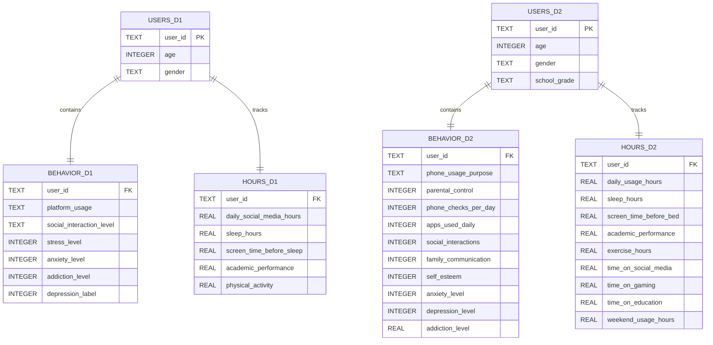

# Teen Smartphone Use and Student Burnout Analysis

## Author

- [@mwrobbins56](https://www.github.com/mwrobbins56)

## Project Overview
Does heavier smartphone and social media use line up with more stress, less sleep, and lower academic performance in teens, and which groups show the clearest signs of mental/emotional burnout?

## Key Findings
1. **Age vs. addiction level** Finding: Age alone does not separate addiction scores in either dataset. The ranges in D1 (Teen_Mental_Health) are from 5.20 to 5.91 across ages 13 to 19 with no real trend. D2 (teen_phone_addiction) stays consistently high, 8.76 to 8.94, across every age.
2. **Screen time bucket vs. sleep** Finding: No clean pattern in either dataset. D1's moderate-usage bucket sleeps least, not the high bucket. D2's low-usage bucket sleeps least, not the high bucket. All buckets in both datasets land within about 15 minutes of each other, arguing against a simple "more usage, less sleep" story.
3. **Addiction level ceiling in D2** Finding: Just over half of the phone addiction dataset, 1,524 of 3,000 students, scores a perfect 10 out of 10 on addiction level. That ceiling effect flattens nearly every other comparison run against that column, including age, gender, and phone usage purpose.
4. **Depression label vs. sleep, D1** Finding: The 31 students out of 1,200 flagged with depression_label average 4.76 hours of sleep, close to two hours less than the 1,169 students without the flag. A real gap, but the group is small and should only show that it's something worth watching, and not really a conclusion.
5. **Academic performance vs. addiction bucket** Finding: Addiction bucket does not cleanly predict academic outcomes in either dataset. D1 stays flat across buckets, 2.98 to 3.01 GPA. D2's low-addiction bucket only has 14 students out of 3,000, too small to trust, and the two buckets with real sample size are close together.

```
Overall, this analysis found more flat and inconsistent patterns than confirmed ones. The clearest finding is a data quality issue, D2's addiction_level column has a hard ceiling that limits what it can show. The findings here seem very similar to the findings presented in another student's project (Smartphone Usage Analysis by Melissa), which I ultimately used as a template in the presenting this project's conclusion: that the value here is in the database design and SQL query practice, not in proving cause and effect from synthetic data.
```

## Project Scope

This project analyzes two independent datasets; teen smartphone usage and mental health stats, using Python, Pandas, SQLite, and SQL. Each dataset was cleaned, processed, and normalized into three related tables (Users, Behavior, and Hours) to reduce repetitions and improve organization. The cleaned data was then imported into a SQLite database where SQL queries were used to answer questions about the data and find trends, plus joins were used to connect the data within each dataset.

Although the datasets contain similar information, they represent different groups of students, collected on different scales for some fields, such as academic_performance being a GPA-style score in one dataset and a 0-100 range in the other. Instead of combining unrelated records, I compare overall trends and differences between the datasets while using SQL joins within each dataset to connect demographic information with smartphone usage, sleep, stress, and academic data.

The goal of this project is to demonstrate a data analysis process, from cleaning raw data and designing a relational database to querying and visualizing the results. The findings show how demographic characteristics and smartphone usage patterns could help schools and families identify students who may benefit from wellbeing guidance, sleep awareness understanding, or academic support. While the datasets are synthetic and do not establish cause-and-effect relationships, they do provide a realistic environment for practicing data analysis, database design, and SQL development.

## Entity Relationship Diagram (ERD)



## Project Structure
| File | Description |
|------|------------|
| `Teen_Mental_Health_Dataset.csv` | First project data file |
| `Data_Clean_Mental_Health.ipynb` | Cleans and processes Teen Mental Health dataset |
| `cleaned_Teen_Mental_Health_Dataset.csv` | Cleaned version of the Teen Mental Health dataset |
| `teen_phone_addiction_dataset.csv` | Second project data file |
| `Data_Clean_teen_phone_addiction.ipynb` | Cleans and processes teen phone addiction dataset |
| `cleaned_teen_phone_addiction_dataset.csv` | Cleaned version of the teen phone addiction dataset |
| `Student_MH_Database_SQL.ipynb` | Creates SQLite database, performs SQL queries, and analyzes results |
| `Student_MentalHealth.db` | SQLite database built from both cleaned datasets |
| `requirements.txt` | Lists the python packages required to run the project |
| `README.md` | Documentation describing the project, setup instructions, and findings |

## Installation

### 1. Clone the repository
**Windows**
```bash
git clone https://github.com/mwrobbins56/Student_MentalHealth.git
cd Student_MentalHealth
```
**macOS/Linux**
```bash
git clone https://github.com/mwrobbins56/Student_MentalHealth.git
cd Student_MentalHealth
```

### 2. Create a virtual environment
**Windows**
```bash
python -m venv venv
```
**macOS/Linux**
```bash
python3 -m venv venv
```

### 3. Activate the virtual environment
**Windows (Command Prompt)**
```bash
venv\Scripts\activate
```
**Windows (PowerShell)**
```powershell
.\venv\Scripts\Activate.ps1
```
**macOS/Linux**
```bash
source venv/bin/activate
```

### 4. Install dependencies
**Windows, macOS, Linux**
```bash
pip install -r requirements.txt
```

### 5. Run the project
```
Open the notebooks in VS Code or Jupyter Notebook and run them in this order:
1. Data_Clean_Mental_Health.ipynb
2. Data_Clean_teen_phone_addiction.ipynb
3. Student_MH_Database_SQL.ipynb
```

### 6. Deactivate the virtual environment
```bash
deactivate
```

## Sources

**Teen_Mental_Health_Dataset**
*Kaggle - argonnxx - https://www.kaggle.com/datasets/argonnxx/teen-mental-health*

**teen_phone_addiction_dataset**
*Kaggle - sumedh1507 - https://www.kaggle.com/datasets/sumedh1507/teen-phone-addiction*

## FAQ

#### Are the datasets synthetic or collected?

    Both datasets were synthetically created by other users to represent teen phone usage and mental health factors. This is not organic data.

#### How many hours went into the creation of this project?

    May 13, 2026 - 16 hours
    May 20, 2026 - 20 hours
    June 15, 2026 - 23 hours
    August 11, 2026 - 22 hours
    August 12, 2026 - 20 hours

#### Why didn't you join the two datasets together?

    Although both datasets contain similar information, they represent different groups of students, and some shared field names measure different scales, like academic_performance being a GPA-style score in one dataset and a 0-100 score in the other. Joining them by user_id would create relationships that do not exist and would compare numbers that are not on the same scale. Instead, I built a relational database that allows for comparisons between the datasets using summary statistics, while joins were only used within each dataset where the tables shared the same students.

#### Did you use AI assistance?

    Yes, portions of this project were completed with the assistance of Anthropic's Claude. Claude was used to help design the database schema, write and debug SQL and Python code, and structure this documentation. All code, analysis, and written explanations were reviewed, understood, and can be modified by the author prior to being used.

#### Which technologies did you use?

    Python
    SQL
    Pandas
    Matplotlib
    Numpy
    Seaborn
    SQLite3
    Jupyter Notebook
    Visual Studio Code
    Git
    GitHub
